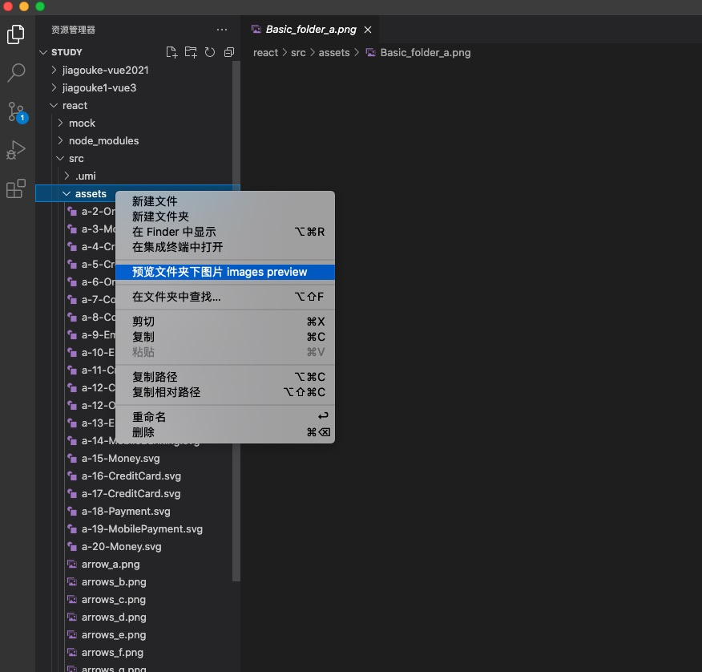
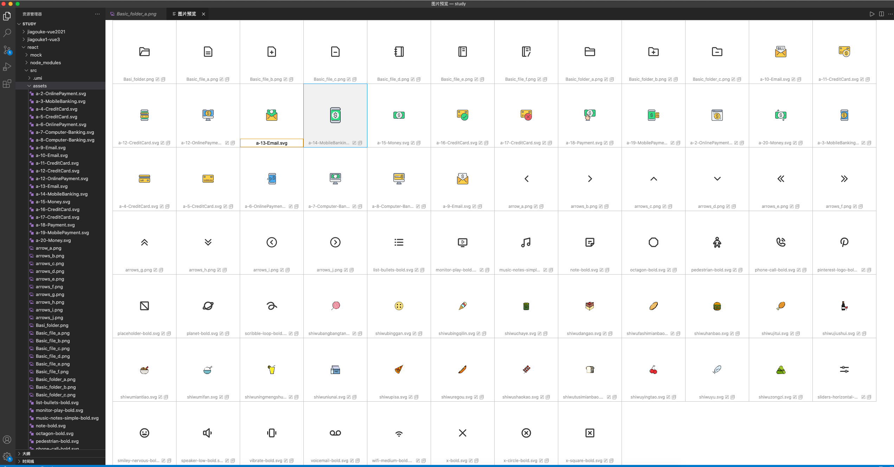

# images-preview

> vscode编辑器打开的项目不方便查看所有图片，这个插件可以在vscode中预览全部图片，并可以对图片重命名和复制文件名，起到辅助管理图片作用

## 使用方法

在图片文件夹右键，选择「预览文件夹下图片 images preview」，即可打开图片预览功能

#### 编辑文件名
点击编辑图标，弹出编辑框

#### 复制文件名
点击复制图标，复制到剪贴板
